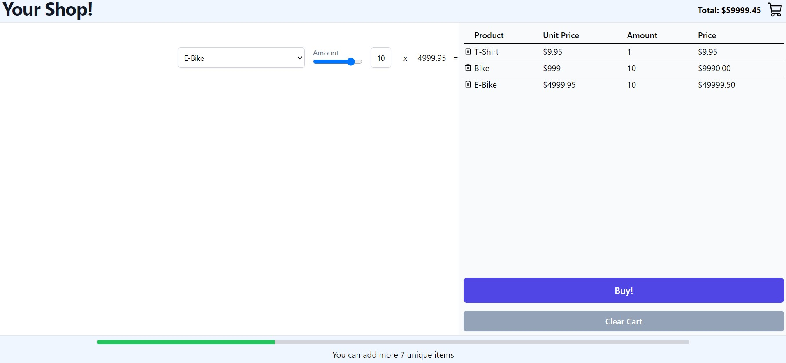

# Bicycle e-commerce



## What does it do?

[x]  As a customer I want to be able to select products from the drop down list.

[ ]  As a customer I would like to be able to determine the quantity of the product before I add it to the shopping cart.

[ ]  As a customer I would like to be informed when I exceed the maximum number of products and be prevented from entering more than this number

[ ]  As a customer I want to be able to see all my products in the shopping cart

[ ]  As a customer I want to be able to see the unit price in my shopping cart.

[ ] There is a value "taxRate" that calculate the gross price for each product.

[ ]  As a customer I want to be able to see the total of the shopping cart at any time

[ ]  As a customer I want to be able to remove products from the shopping cart either one by one or by all at one by pressing the "clear Cart" button.

[ ]  It's not allowed to add more than 10 different product types in the shopping cart. As a customer I want to be able to see a visual representation of how many product types I can still add in a progress bar on the bottom.

[ ]  As a customer I want to see a graphical overlay when I confirm the purchase to know that my order was successful

[ ]  It is not allowed to add a quantity of items to the shopping cart that exceeds the "**maxAmount**" of the respective product. As a customer I want to be able to select the quantity of products with a slider

## What is inside?

This project uses many tools like:

- [Vite](https://vitejs.dev)
- [ReactJS](https://reactjs.org)
- [TypeScript](https://www.typescriptlang.org)
- [Vitest](https://vitest.dev)
- [Testing Library](https://testing-library.com)
- [Tailwindcss](https://tailwindcss.com)
- [Eslint](https://eslint.org)
- [Prettier](https://prettier.io)

## Getting Started

For this project I used Node.js v19.7.0 and PNPM v7.30.0

### Install

Clone this project

```bash
git clone https://github.com/ViniciusLagoGehrke/bike_E-commerce.git
```

Access the project directory.

```bash
cd bike_E-commerce
```

Install dependencies. (I suggest using PNPM)

```bash
pnpm install
```

Serve with hot reload at <http://localhost:5173>.

```bash
pnpm run dev
```

### Lint

```bash
pnpm run lint
```

### Typecheck

```bash
pnpm run typecheck
```

### Build

```bash
pnpm run build
```

### Test

```bash
pnpm run test
```

View and interact with your tests via UI. (Awesone vitest feature!)

```bash
pnpm run test:ui
```

## Deployment

I deployed this project in Vercel where you can Log in with GitHub, GitLab, Bitbucket, or email to deploy websites for free with zero configuration, automatic SSL, and global CDN.

You can check it live here: [Bike E-Commerce]()

